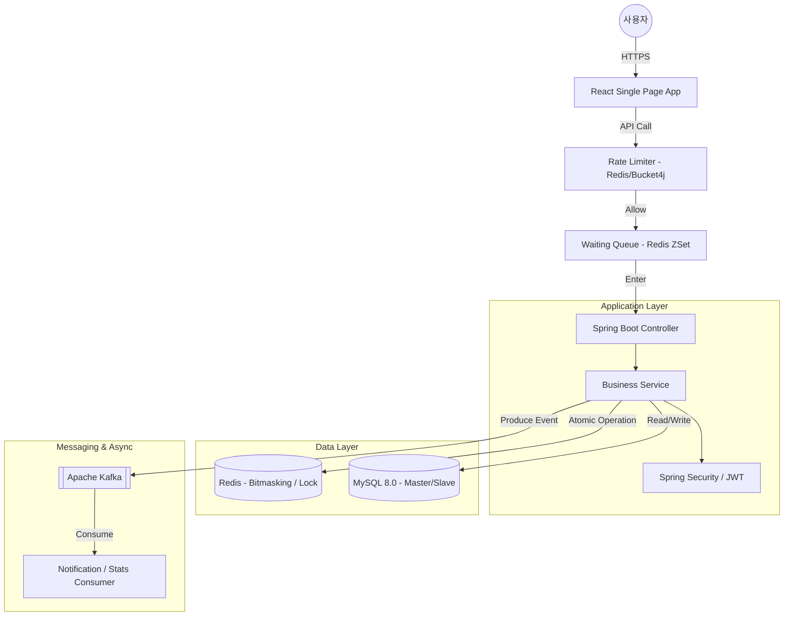
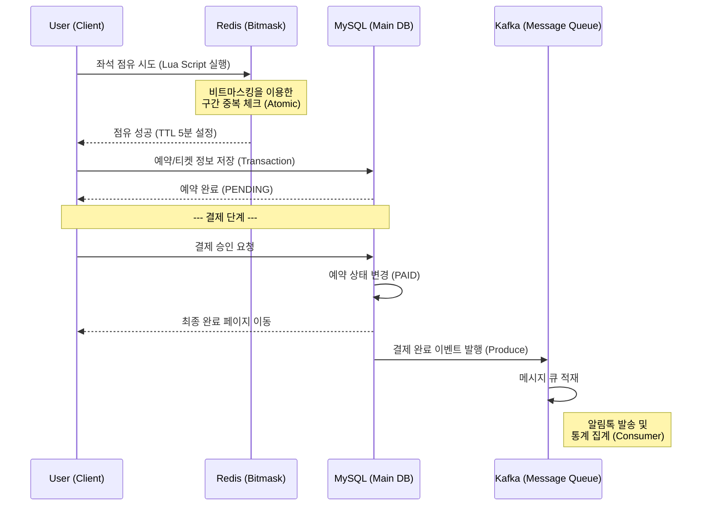

# 🚄 XRail: 고속열차 예매 시스템 (High-Concurrency Train Reservation)


## 📖 프로젝트 개요
**XRail**은 대용량 트래픽 환경에서도 데이터 무결성을 보장하며 안정적인 예매 서비스를 제공하는 **고성능 철도 예매 플랫폼**입니다.
실제 코레일(Korail) 시스템을 벤치마킹하여 **구간 예매(Segment Booking)**, **동시성 제어**, **대기열 시스템** 등 복잡한 비즈니스 로직을 완벽하게 구현했습니다.

---

## 🏗 시스템 아키텍처 및 기술 스택

### Architecture Diagram


---

## 🔄 핵심 데이터 플로우 (Data Flow)

### 1. 예약 및 결제 프로세스 (Reservation Flow)


### 2. 기술적 활용 상세
*   **Redis (Concurrency Control):**
    *   **Lua Script:** 좌석 조회와 점유 비트 업데이트를 하나의 원자적 단위로 묶어 다중 서버 환경에서도 동시성 문제를 해결했습니다.
    *   **Segment Bitmasking:** 하나의 열차 좌석을 구간별(서울-대전, 대전-부산 등)로 쪼개어 비트 연산으로 관리함으로써 공간 효율성과 연산 속도를 극대화했습니다.
*   **Apache Kafka (Asynchronous Processing):**
    *   예약 완료나 결제와 같이 트랜잭션이 중요한 로직에서 알림 발송, 로그 수집 등 시간이 소요되는 부가 작업을 비동기로 분리하여 사용자 응답 속도를 개선했습니다.
*   **Waiting Queue:**
    *   접속 폭주 시 Redis의 `Sorted Set`을 사용하여 진입 순서를 보장하고, 서버가 감당 가능한 수준의 트래픽만 인스턴스에 전달되도록 제어합니다.

---

## ⚡ 핵심 기능 및 기술적 도전 (Key Features)

### 1. 동시성 제어 및 데이터 무결성 (Concurrency Control)
*   **Redis Lua Script:** 좌석 선점(Pre-booking) 시 **조회와 점유를 원자적(Atomic)으로 처리**하여 Race Condition을 원천 차단했습니다.
*   **비트마스킹(Bitmasking) 구간 예매:** 
    *   서울→대전(구간 A), 대전→부산(구간 B) 예매 시, 동일 좌석이라도 구간이 겹치지 않으면 중복 예약을 허용하는 효율적인 비트 연산 로직을 구현했습니다.
*   **낙관적/비관적 락:** DB 레벨에서의 데이터 충돌을 방지하기 위해 JPA Lock을 적절히 혼합 사용했습니다.

### 2. 대용량 트래픽 대응 (Traffic Management)
*   **대기열 시스템 (Waiting Queue):** 접속 폭주 시 Redis `Sorted Set`을 활용한 대기열 토큰 발급 시스템으로 서버 부하를 일정하게 유지합니다.
*   **Rate Limiting:** Bucket4j를 활용하여 비정상적인 매크로 및 과도한 API 호출을 차단합니다.

### 3. 고도화된 예약 프로세스
*   **실시간 매진 처리:** 특정 구간의 예매 티켓 수와 열차 정원을 실시간으로 비교하여 매진 여부를 정확히 표시합니다.
*   **임박 열차 제한:** 출발 5분 전 열차에 대한 예약 차단 로직으로 운영 리스크를 최소화했습니다.
*   **보안 강화:** 비회원 예매 시 `Access Code` 발급 및 비밀번호 암호화 저장, 부정 가입 방지를 위한 `Honeypot` 필드 적용.

### 4. 관리자 모니터링 시스템 (Admin Dashboard)
*   **대시보드:** 실시간 매출 및 예매 현황 시각화.
*   **스케줄/티켓 관리:** 날짜별/노선별 필터링 및 페이징 기능을 갖춘 데이터 그리드 제공.
*   **사용자 관리:** 회원/비회원 구분 없이 상세 정보를 조회할 수 있는 통합 뷰 제공.

---

## 🚀 실행 방법 (Getting Started)

### Prerequisites
*   Java 21+
*   Node.js 20+
*   Docker (MySQL, Redis, Kafka)

### 1. 인프라 실행 (Docker)
```bash
docker-compose up -d
```

### 2. Backend 실행
```bash
./gradlew bootRun
```
*   서버가 시작되면 `DataInitializer`가 자동으로 실행되어 초기 역, 열차, 스케줄 데이터를 생성합니다.

### 3. Frontend 실행
```bash
cd frontend
npm install
npm run dev
```
*   브라우저에서 `http://localhost:5173` 접속

---

## 📂 프로젝트 구조
```
XRail/
├── src/main/java/com/dev/XRail
│   ├── common       # 공통 유틸리티, 예외 처리, 초기화 로직
│   ├── domain       # 도메인별(예약, 스케줄, 회원) 비즈니스 로직
│   ├── infra        # Redis, Kafka, RateLimit 등 인프라 계층
│   └── security     # JWT, OAuth2 인증/인가 설정
├── frontend/src
│   ├── api          # Axios API 클라이언트
│   ├── pages        # 주요 페이지 (검색, 예약, 결제, 관리자)
│   └── components   # 재사용 가능한 UI 컴포넌트
└── docker           # Docker 환경 설정 파일
```

---

## 📝 회고 (Retrospective)
이 프로젝트를 통해 대규모 트래픽 환경에서 발생할 수 있는 동시성 이슈를 깊이 있게 고민하고, Redis와 비트마스킹을 활용한 고성능 해결책을 도출했습니다. 또한, 사용자 경험(UX)을 고려한 프론트엔드 설계와 관리자 편의성을 위한 백오피스 구축까지 풀스택 개발의 전 과정을 주도적으로 수행했습니다.
