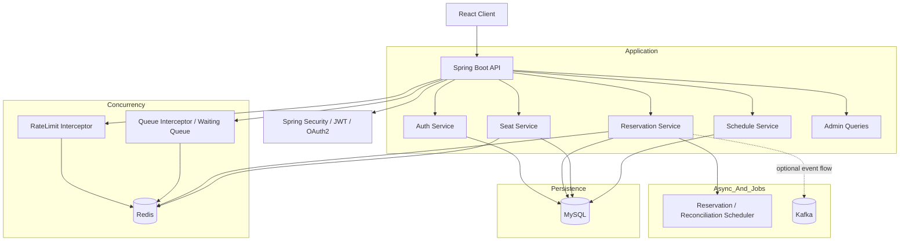
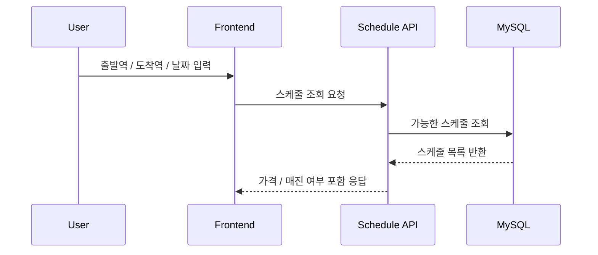
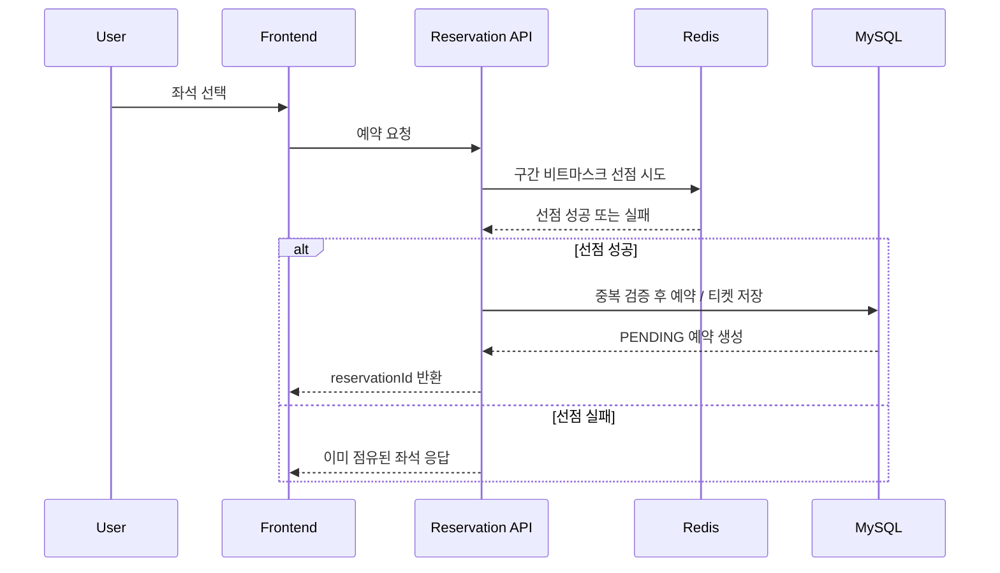
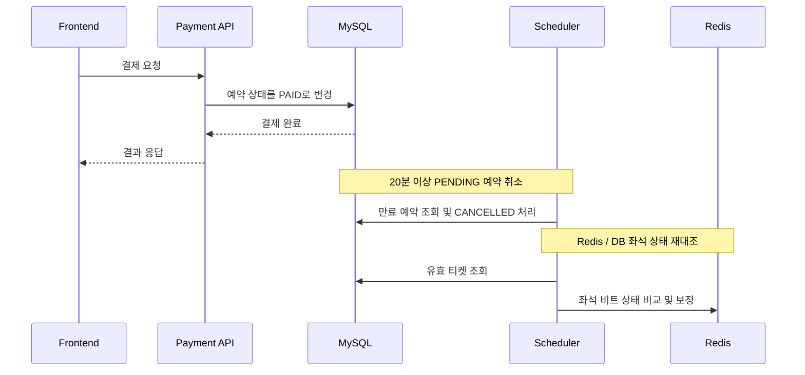

# XRail


XRail은 고속열차 예매 시나리오를 바탕으로 만든 예약 시스템 프로젝트입니다.  
좌석 선점, 구간 예매, 대기열, 비회원 조회, 관리자 조회 화면처럼 실제 서비스에서 문제가 되기 쉬운 흐름을 중심으로 구성했습니다.

## 프로젝트 개요

이 저장소의 핵심 주제는 "동시에 많은 요청이 들어와도 좌석 중복 예약 없이 처리할 수 있는가"입니다.  
이를 위해 예매 과정에서 Redis 비트마스크와 Lua 스크립트로 좌석을 먼저 선점하고, 이후 DB에서 한 번 더 겹침 여부를 확인하는 방식으로 처리합니다.

구현은 Spring Boot 기반의 모듈형 모놀리식 구조로 되어 있으며, 프론트엔드는 React + Vite로 분리되어 있습니다.  
회원 로그인, 비회원 예매, 예약 결제, 예약 조회, 관리자 통계 조회까지 기본 흐름을 한 저장소 안에서 확인할 수 있습니다.

## 백엔드 아키텍처

현재 백엔드는 하나의 Spring Boot 애플리케이션 안에서 도메인별 패키지를 나눈 모듈형 모놀리식 구조입니다.  
예약 로직은 `domain.reservation`, 검색은 `domain.schedule`, 사용자 인증은 `domain.user`, 대기열은 `domain.queue`, 공통 인터셉터와 예외 처리는 `common` 패키지에 모여 있습니다.


```mermaid
graph TD
    Client[React Client] --> API[Spring Boot API]
    API --> Security[Spring Security / JWT / OAuth2]
    API --> RateLimit[RateLimit Interceptor]
    API --> Queue[Queue Interceptor / Waiting Queue]

    subgraph Application
        API --> ScheduleService[Schedule Service]
        API --> SeatService[Seat Service]
        API --> ReservationService[Reservation Service]
        API --> AuthService[Auth Service]
        API --> AdminService[Admin Queries]
    end

    subgraph Persistence
        ScheduleService --> MySQL[(MySQL)]
        SeatService --> MySQL
        ReservationService --> MySQL
        AuthService --> MySQL
    end

    subgraph Concurrency
        SeatService --> Redis[(Redis)]
        ReservationService --> Redis
        Queue --> Redis
        RateLimit --> Redis
    end

    subgraph Async_And_Jobs
        ReservationService --> Scheduler[Reservation / Reconciliation Scheduler]
        ReservationService -. optional event flow .-> Kafka[(Kafka)]
    end
```

백엔드에서 중요한 지점은 두 군데입니다.

- 요청 진입부에서는 Rate Limit과 대기열 인터셉터가 먼저 동작합니다.
- 예약 처리부에서는 Redis 선점과 DB 저장을 함께 써서 좌석 중복을 막습니다.

## 데이터 플로우

### 1. 열차 조회

사용자가 출발역, 도착역, 날짜를 선택하면 스케줄 검색 API가 노선 순서를 기준으로 가능한 열차를 조회합니다.  
응답에는 열차 정보, 출발/도착 시각, 계산된 요금, 매진 여부가 포함됩니다.


```mermaid
sequenceDiagram
    participant U as User
    participant F as Frontend
    participant B as Schedule API
    participant DB as MySQL

    U->>F: 출발역 / 도착역 / 날짜 입력
    F->>B: 스케줄 조회 요청
    B->>DB: 가능한 스케줄 조회
    DB-->>B: 스케줄 목록 반환
    B-->>F: 가격 / 매진 여부 포함 응답
```

### 2. 좌석 조회와 선점

좌석 조회 단계에서는 DB에 저장된 확정 좌석과 Redis에 남아 있는 임시 선점 좌석을 함께 봅니다.  
예약 요청이 들어오면 Redis Lua 스크립트로 먼저 구간 점유를 시도하고, 성공한 좌석만 DB 저장 단계로 넘어갑니다.


```mermaid
sequenceDiagram
    participant U as User
    participant F as Frontend
    participant B as Reservation API
    participant R as Redis
    participant DB as MySQL

    U->>F: 좌석 선택
    F->>B: 예약 요청
    B->>R: 구간 비트마스크 선점 시도
    R-->>B: 선점 성공 또는 실패
    alt 선점 성공
        B->>DB: 중복 검증 후 예약 / 티켓 저장
        DB-->>B: PENDING 예약 생성
        B-->>F: reservationId 반환
    else 선점 실패
        B-->>F: 이미 점유된 좌석 응답
    end
```

### 3. 결제와 후속 처리

결제 요청이 들어오면 예약 상태를 `PAID`로 바꾸고, 비회원이면 Access Code를 함께 반환합니다.  
결제가 끝나지 않은 예약은 스케줄러가 정리하고, Redis와 DB 상태가 어긋나면 재대조 스케줄러가 보정합니다.


```mermaid
sequenceDiagram
    participant F as Frontend
    participant B as Payment API
    participant DB as MySQL
    participant S as Scheduler
    participant R as Redis

    F->>B: 결제 요청
    B->>DB: 예약 상태를 PAID로 변경
    DB-->>B: 결제 완료
    B-->>F: 결과 응답

    Note over S,DB: 20분 이상 PENDING 예약 취소
    S->>DB: 만료 예약 조회 및 CANCELLED 처리

    Note over S,R: Redis / DB 좌석 상태 재대조
    S->>DB: 유효 티켓 조회
    S->>R: 좌석 비트 상태 비교 및 보정
```

## 문서 안내

- `README.md`: 프로젝트 개요와 실행 방법
- `xrail_specification.md`: 요구사항과 설계 요약본
- `xrail_specification.docx`: 상세 기술 명세 문서
- `HELP.md`: Spring Initializr 기본 안내 문서
- `frontend/README.md`: Vite 기본 템플릿 문서

프로젝트를 이해하려면 `xrail_specification.md`와 실제 코드 구현을 함께 보는 편이 좋습니다.  
문서에는 확장 방향까지 포함되어 있고, 현재 저장소에는 단일 애플리케이션 기준 구현이 우선 반영되어 있습니다.

## 핵심 구현 포인트

### 1. 구간 예매와 좌석 선점

- 좌석 점유 정보는 Redis에 `sch:{scheduleId}:seat:{seatId}` 형태로 저장합니다.
- 출발역과 도착역 사이 구간을 비트마스크로 계산해 겹치는 구간만 막습니다.
- Redis Lua 스크립트로 선점한 뒤, DB에서 다시 중복 여부를 확인해 정합성을 보강합니다.
- 예약 저장 중 예외가 나면 Redis 선점 정보를 즉시 해제합니다.

### 2. 대기열과 요청 제어

- Redis Sorted Set 기반 대기열 서비스가 구현되어 있습니다.
- 인터셉터에서 예약 관련 API 진입 전에 대기열 통과 여부를 검사합니다.
- Bucket4j와 Redisson을 이용해 IP 기준 요청 제한을 적용합니다.

### 3. 예약 라이프사이클

- 예약 생성 시 상태는 `PENDING`으로 저장됩니다.
- 결제 완료 시 `PAID`로 변경됩니다.
- 20분 동안 결제가 완료되지 않으면 스케줄러가 자동 취소합니다.
- Redis와 DB 좌석 상태가 어긋날 경우를 대비해 재대조 스케줄러가 동작합니다.

### 4. 사용자 유형

- 회원은 아이디/비밀번호 로그인과 OAuth2 로그인을 사용할 수 있습니다.
- 비회원은 이름, 전화번호, 비밀번호로 등록한 뒤 발급된 Access Code로 예약을 조회할 수 있습니다.
- 회원가입 DTO에는 봇 입력을 막기 위한 Honeypot 필드가 포함되어 있습니다.

### 5. 관리자 화면

- 날짜 기준 매출과 발권 건수를 조회할 수 있습니다.
- 스케줄 목록과 티켓 목록을 페이지 단위로 조회할 수 있습니다.
- 회원과 비회원 정보를 하나의 화면에서 확인할 수 있도록 구성되어 있습니다.

## 기술 스택

### Backend

- Java 21
- Spring Boot 3.4.12
- Spring Security
- Spring Data JPA
- QueryDSL
- Redis
- Kafka
- Flyway 의존성 포함

### Frontend

- React 19
- TypeScript
- Vite
- React Router
- Axios

### Infrastructure

- MySQL 8
- Redis
- Kafka
- Zookeeper
- Docker Compose

## 디렉터리 구조

```text
XRail/
├─ src/main/java/com/dev/XRail
│  ├─ common      공통 응답, 예외 처리, 인터셉터, 데이터 초기화
│  ├─ config      보안, Kafka, QueryDSL, WebMvc 설정
│  ├─ domain      예약, 스케줄, 역, 열차, 사용자, 대기열 도메인
│  ├─ infra       Kafka, Redis, Rate Limit 연동
│  └─ security    JWT, OAuth2, UserDetails 구현
├─ src/main/resources
│  ├─ application.yaml
│  ├─ db/migration
│  └─ scripts
├─ frontend/src
│  ├─ api
│  ├─ components
│  ├─ pages
│  └─ services
└─ docker
```

## 실행 방법

### 사전 준비

- Java 21
- Node.js 20 이상
- Docker

### 1. 인프라 실행

필수 인프라만 먼저 올리는 방식이 가장 안전합니다.

```bash
docker-compose up -d mysql redis zookeeper kafka
```

### 2. 백엔드 실행

```bash
./gradlew bootRun
```

서버가 시작되면 `DataInitializer`가 역, 노선, 열차, 좌석, 스케줄 데이터를 자동으로 채웁니다.

### 3. 프론트엔드 실행

```bash
cd frontend
npm install
npm run dev
```

- 프론트엔드: `http://localhost:5173`
- 백엔드 API: `http://localhost:8088`

## 참고할 점

- 명세 문서에는 Redis Cluster, MySQL Master/Slave, 외부 알림 같은 확장 설계가 포함되어 있습니다.
- 현재 저장소는 로컬 개발과 기능 검증에 초점을 둔 구성입니다.
- 대기열 API는 구현되어 있지만 프론트 화면에서는 아직 직접 연결되어 있지 않습니다.
- Kafka 프로듀서와 컨슈머 클래스는 존재하지만, 예약 결제 흐름과의 연결은 추가 정리가 필요합니다.

## 회고

이 프로젝트는 단순한 CRUD보다 예매 도메인에서 자주 문제가 되는 동시성, 구간 계산, 임시 선점, 만료 처리 같은 주제를 다루는 데 의미가 있습니다.  
문서와 코드를 같이 보면 설계 의도와 현재 구현 상태를 함께 파악하기 좋습니다.
